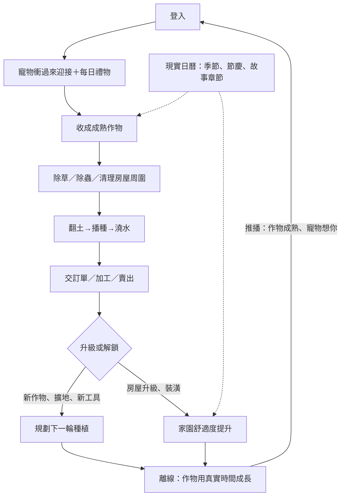

# 00 — 專案總覽與規劃索引

> 專案代號 `happyFarm`，暫定名《暖暖農場》。
> 本資料夾是整個遊戲的規劃書入口。所有數值集中在 `06-成長曲線與經濟.md`，其他文件只引用、不重複定義。
> 標注 **[待確認]** 的條目是我先給的建議值，開工前可以再調。

---

## 1. 產品北極星

| 項目 | 定義 |
|---|---|
| 一句話定位 | 皮克斯風 3D 療癒農場養成：帶著自己挑的寵物夥伴，在會跟著**真實季節與晝夜**變化的農場裡種田、除草、蓋房子 |
| 致敬對象 | 開心農場（偷菜、幫忙除草的社交樂趣）＋ 動物森友會（跟現實日曆同步的年度輪迴）＋ Hay Day（拖曳連續操作的手感） |
| 核心體驗 | 每次 5–10 分鐘的舒壓收成 ＋ 長期看得見的家園成長 |
| 平台 | Web：PC 瀏覽器 ＋ 手機瀏覽器，可安裝成 PWA 加到主畫面 |
| 商業模型 | **不做付費**，所有內容都能靠遊玩取得 |
| 黏著目標 | 一般玩家（每天上線 3 次、合計約 20 分鐘）需要**約 13 個月**才會把等級、房屋、寵物、圖鑑全部走完 |
| 成功公式 | 30 秒愛上寵物 ＋ 3 分鐘第一次收成 ＋ 每天回來 3 次 ＋ 一年後還有沒看過的季節內容 |

---

## 2. 設計支柱

| # | 支柱 | 具體規則 |
|---|---|---|
| 1 | **療癒、不懲罰** | 作物不會枯死、寵物不會生病或離家出走、登入印章不要求連續。玩家缺席時，遊戲只會表達「想你」，不會扣東西 |
| 2 | **真實時間的期待感** | 作物用真實時間成長；季節、晝夜、節慶都和現實日曆同步 |
| 3 | **看得見的成長** | 房屋升級、寵物長大、農場擴張，全部是 3D 場景裡看得見的變化，不只是數字 |
| 4 | **每個動作都好摸** | 拔草、收成、澆水都有擠壓伸展（squash & stretch）、粒子和音效，讓動作本身就有樂趣 |
| 5 | **日曆閘門** | 季節作物、節慶、故事章節都鎖在現實日曆上。就算玩家狂刷等級，一年份的內容也不會提早被吃光 |

---

## 3. 已定案決策（2026-09-30）

| 決策 | 選擇 | 影響 |
|---|---|---|
| 技術平台 | Web ＋ Three.js | PC 和手機共用同一份程式；和既有的 Pinball3D、Minecraft 專案同一套技術 |
| 連線與社交 | 分階段 | Phase 1 單機（本機存檔），架構上預留後端；Phase 2 再加帳號、雲端存檔、拜訪、偷菜、幫忙除草 |
| 商業化 | 不做付費 | 沒有付費貨幣；季節手帳（季票）完全免費，只用來排節奏 |
| 3D 美術 | 混合 | 場景、作物、道具用程式建模；主角和寵物用 Blender 建模並綁骨架，匯出 GLB |

---

## 4. 文件索引

| 編號 | 檔案 | 內容 |
|---|---|---|
| 00 | `00-專案總覽.md` | 北極星、設計支柱、決策紀錄、索引、用語表 |
| 01 | `01-核心玩法與操作.md` | 三層遊戲迴圈、所有動作、PC 與手機操作、鏡頭、HUD、新手流程 |
| 02 | `02-主角與寵物系統.md` | 主角外觀、4 選 1 寵物、親密度、成長階段、寵物 AI、動畫清單 |
| 03 | `03-房屋與農場空間.md` | 農場地圖、房屋 5 階、室內裝潢、**房屋周圍除草系統**、擴地 |
| 04 | `04-作物與季節內容.md` | 54 種作物、果樹、巨型作物、夜間花、天氣、晝夜、圖鑑 |
| 05 | `05-一年黏著設計.md` | **核心需求**：日／週／月／季／年節奏、12 個月路線圖、節慶表、回流保護、第二年 |
| 06 | `06-成長曲線與經濟.md` | 等級公式、作物經濟、貨幣、產出與消耗、擴地與房屋價格 |
| 07 | `07-技術架構與美術管線.md` | 技術棧、時間與存檔模型、皮克斯風渲染、效能預算、素材管線、**DEV 微調工具** |
| 08 | `08-社交與後端-第二階段.md` | 後端選型、伺服器權威、好友、拜訪、偷菜、幫忙、推播 |
| 09 | `09-開發里程碑與風險.md` | M0–M5 里程碑、驗收標準、風險清單、下一步 |

---

## 5. 系統架構總圖

---

## 6. 用語表

| 術語 | 定義 |
|---|---|
| 地塊（Plot） | 1×1 的可耕作田地，一塊種一株作物 |
| 雜草（Weed） | 在房屋周圍、田邊、小徑自然長出的可清除物件，會隨季節換成落葉堆、積雪等 |
| 親密度（Bond） | 玩家和寵物的感情等級，1–10 級 |
| 家園舒適度（Coziness） | 房屋內外的整潔度與裝飾分數，影響寵物心情與 NPC 訪客 |
| 圖鑑（Almanac） | 作物（含品質變體）、寵物、裝飾、節慶收藏品的收集紀錄 |
| 季節手帳（Season Journal） | 每季 30 階的免費獎勵路線（概念類似季票），不需付費 |
| 日曆閘門（Calendar Gate） | 用現實日期鎖住的內容，例如只有 10 月能種的作物 |
| 休息加成（Rested XP） | 離線期間累積，回來後收成 XP ×2，直到額度用完 |
| 動作佇列（Action Queue） | 玩家連續點擊的動作會排隊，由角色依序走過去執行 |
| DEV 工具 | 內建的開發者微調面板，可拖曳版面、調光影、快轉時間、觸發各種狀態 |

---

## 7. Changelog

| 版本 | 日期 | 變更 | 作者 |
|---|---|---|---|
| 0.1.0 | 2026-09-30 | 初版規劃 | Claude |
