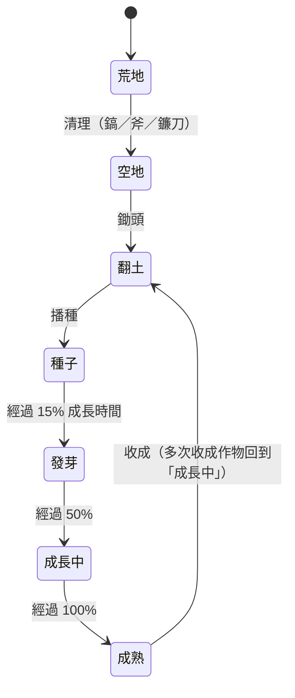

# 01 — 核心玩法與操作

---

## 1. 三層遊戲迴圈

| 迴圈 | 時間尺度 | 內容 | 玩家感受 |
|---|---|---|---|
| 短迴圈 | 單次 5–10 分鐘 | 寵物迎接 → 收成 → 除草／除蟲 → 播種澆水 → 交訂單 → 離開 | 舒壓、手感、立即回饋 |
| 中迴圈 | 每天、每週 | 升級解鎖新作物、擴地、工具升級、加工坊、訂單板、每週挑戰 | 看得見的進步 |
| 長迴圈 | 每月到一年 | 季節輪替、節慶、房屋 5 階、寵物長大、圖鑑、小鎮故事章節 | 期待、收集、歸屬感 |

---

## 2. 作物狀態機



### 2.1 照顧規則（只給加成、不給懲罰）

| 狀態 | 效果 | 解除方式 |
|---|---|---|
| 乾燥 | 成長速度 ×0.6（**不會停止、不會枯死**） | 澆水一次、下雨自動解除、鴨子寵物潑水 |
| 田上長草 | 每株雜草讓產量 −10%，最多 −30% | 拔草、兔子寵物吃掉 |
| 害蟲 | 品質有機率降一階 | 除蟲、鴨子寵物抓蟲 |
| 施肥 | 品質升階機率提高（見 `06 §5`） | 堆肥桶產出的有機肥 |

作物成熟後**永遠不會壞掉**，會一直等玩家回來收。

---

## 3. 動作清單

| 動作 | 工具 | 角色動畫時長 | 產出 | 備註 |
|---|---|---:|---|---|
| 清理荒地 | 鎬（石頭）、斧（樹樁）、鐮刀（大草叢） | 0.8 s × 2–3 下 | 石材、木材、雜草 | 擴地前置 |
| 翻土 | 鋤頭 | 0.5 s | — | 可拖曳連續翻 |
| 播種 | 種子袋 | 0.4 s | — | 可拖曳連續播 |
| 澆水 | 水壺（後期換灑水器） | 0.5 s | 解除乾燥 | 雨天全部自動澆 |
| 施肥 | 有機肥 | 0.4 s | 品質加成 | — |
| 除草 | 手、鐮刀、除草機 | 0.6 s（手拔） | 雜草、XP、小機率寶物 | 詳見 `03 §4` |
| 除蟲 | 手、捕蟲網 | 0.5 s | XP、蟲蟲圖鑑 [待確認] | — |
| 收成 | 手 | 0.35 s | 作物、XP | 作物會彈跳飛進背包 |
| 撫摸寵物 | — | 1.2 s | 親密度 | 每日 3 次有效 |
| 餵寵物 | 食物 | 1.5 s | 親密度、飽足 | 喜好食物加成 |
| 丟球玩耍 | 球 | 小遊戲 10 s | 親密度 | L6 解鎖 |
| 進屋 | — | 開門 0.6 s | 切到室內場景 | M3 解鎖室內 |

### 3.1 動作佇列（解決「角色要走過去」的慢感）

- 玩家點擊或拖曳過的目標會**排進佇列**，角色依序走過去執行，畫面上方顯示佇列圖示（最多 60 個）。
- 同一排的地塊，角色會沿直線一路做完，不會每塊來回走。
- 角色移動速度 4.5 m/s（比一般走路快），轉身 0.1 s。
- 設定裡提供「**快速模式**」：動作即時生效，角色只做象徵性的動作。給追求效率的玩家與無障礙需求使用。

---

## 4. 操作

| 功能 | PC | 手機 |
|---|---|---|
| 移動 | 點地面、或 WASD | 點地面（可選虛擬搖桿，預設關） |
| 互動 | 點目標、或 Space 對最近目標 | 點目標、或右下角動作鈕 |
| 連續操作 | 按住左鍵拖過多塊地 | 手指按住拖過多塊地 |
| 切換工具 | 數字鍵 1–8、滾輪＋Shift | 底部工具列 |
| 縮放 | 滾輪 | 兩指縮放 |
| 旋轉鏡頭 | Q／E（每次 90°） | 兩指旋轉（放開後吸附到 45° 的倍數） |
| 背包／圖鑑 | B／J | HUD 按鈕 |
| DEV 工具 | `` ` `` 鍵或 F2（僅開發版或網址加 `?dev=1`；D 已被 WASD 使用） | 右下角齒輪（同樣條件） |

**智慧工具**：點擊空地自動用鋤頭、點翻好的土自動播上次的種子、點乾燥作物自動澆水、點成熟作物自動收成。多數時候玩家不需要手動切工具。

---

## 5. 鏡頭

| 參數 | 值 | 說明 |
|---|---|---|
| 投影 | 透視，FOV 30° | 低 FOV 的長焦感，像在看一座微縮模型 |
| 俯角 | 50°（可縮放時在 40°–60° 之間變化） | 拉近時更平視，比較有臨場感 |
| 距離 | 12–28 m | 手機直式預設拉遠 20% |
| 跟隨 | 角色超出畫面中央 30% 範圍才跟，阻尼 0.12 | 不會一直晃 |
| 旋轉 | 4 個主方向＋45° 吸附 | 房子不會被擋住 |

所有數值都放在 `LAYOUT_PC`、`LAYOUT_MOBILE`、`LAYOUT_TABLET` 裡，用 DEV 工具即時調整（見 `07 §7`）。

---

## 6. HUD 配置

```
┌──────────────────────────────────────────────┐
│ [頭像 Lv23 ▓▓▓▓░░]            [☀ 秋 10/03] [🪙 12,480] │
│ [寵物心情 ♥♥♥♥]                     [📋訂單] [📖圖鑑] │
│                                              │
│                  3D 場景                      │
│                                              │
│ [動作佇列: 🌾🌾🌾💧💧]                          │
│ [鋤][種][水][肥][鐮][網]            [🎒] [●動作] │
└──────────────────────────────────────────────┘
```

- 手機直式：工具列移到底部置中，訂單和圖鑑收進右上角選單。
- 觸控目標最小 44×44 pt，重要按鈕 56×56 pt。
- 支援安全區域（瀏海、Home Indicator）。

---

## 7. 新手流程（目標：8 分鐘內完成）

| 步驟 | 內容 | 時間點 |
|---|---|---|
| 1 | 開場：收到奶奶的信，繼承一座荒廢的農場（15 秒，可跳過） | 0:00 |
| 2 | 捏主角：體型、膚色、髮型、服裝顏色 | 0:15 |
| 3 | **選寵物**：4 隻寵物在轉盤上輪流展示個性動畫，點選後取名 | 0:45 |
| 4 | 寵物帶路走到田邊，教「點地面移動」 | 1:30 |
| 5 | 房子前面長滿雜草，教**手拔草**（連拔 5 株，體驗連擊） | 2:00 |
| 6 | 翻土 → 種蘿蔔（1 分鐘成熟）→ 澆水 | 2:45 |
| 7 | 等待期間教撫摸寵物、看寵物技能 | 3:15 |
| 8 | 收成 → 升 Lv2 → 解鎖小麥 | 4:00 |
| 9 | 清完房屋周圍雜草 → 房子從「破舊」變成「整理過」的小動畫 | 5:30 |
| 10 | 郵筒出現第一張訂單 → 交付 → 拿到第一筆金幣 | 6:30 |
| 11 | 傍晚光線示範、寵物回狗屋、預告「明天作物會長好」 | 7:30 |

---

## 8. 最後更新

- 版本 0.1.0／2026-09-30／審查狀態：待確認
